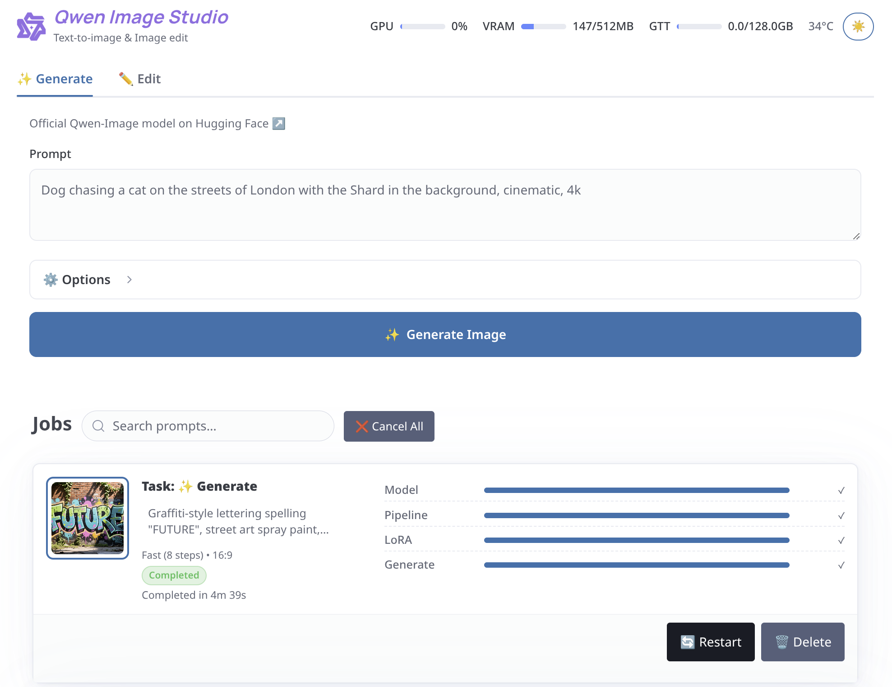

# Qwen Image Studio



A WebUI and job manager for [**qwen-image-mps**](https://github.com/ivanfioravanti/qwen-image-mps), extended with:

* **FastAPI + WebSocket server** (`qwen-image-studio/server.py`)
* **Browser UI** (`qwen-image-studio/static/`) with live job tracking and GPU stats
* **Improved CLI** (still available):

  * LoRA adapters merged with **PyTorch on GPU**
  * More verbose, structured CLI output for server integration

---

## Quick Start (WebUI)

Install dependencies:

```bash
pip install -r requirements.txt
```

Run the server:

```bash
uvicorn qwen-image-studio.server:app --reload --host 0.0.0.0 --port 8000
```

Then open [http://localhost:8000/](http://localhost:8000/) in your browser.

The UI supports:

* Text-to-image (`✨ Generate`)
* Image editing (`✏️ Edit`)
* Options: steps, seed, resolution, fast/ultra-fast modes, custom LoRA, Batman mode 🦇
* Job queue with progress & retries
* AMD GPU stats (via `rocm-smi`)

---

## CLI Usage

The original CLI remains available under `qwen-image-mps` or `python qwen-image-mps.py`.
See the [**full README of qwen-image-mps**](https://github.com/ivanfioravanti/qwen-image-mps) for details.

Additional flags in this fork:

* `--lora <path|HF repo>` → LoRA adapters loaded on GPU via PyTorch

---

## Platform Notes

Tested on:

* **Framework Laptop 16 (AMD “Strix Halo” Ryzen AI MAX+ 395)**
* 128 GB unified RAM, Fedora 42 (Linux 6.15.9-201.fc42.x86\_64)
* AMD GPU with `rocm-smi` for stats

Should also work on **CPU, MPS, NVIDIA** with minimal adaptation (PRs welcome!).

---

## License

Same as the upstream [qwen-image-mps](https://github.com/ivanfioravanti/qwen-image-mps) project.

